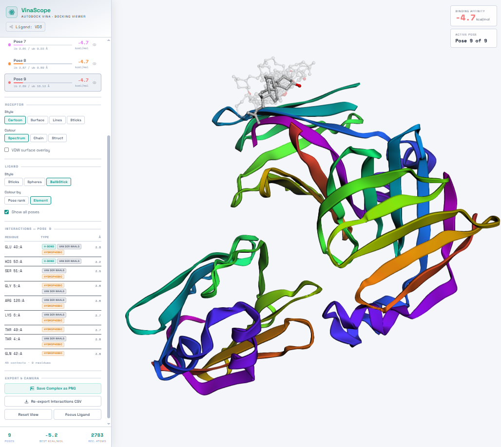

# py-VinaScope-Docking-Viewer

**AutoDock Vina · Docking Viewer** — a zero-dependency Python script that packages AutoDock Vina docking results into a single, self-contained HTML file with an interactive 3D molecular viewer.

[](#)
[](#)
[](https://3dmol.csb.pitt.edu)

---

## Overview

After running an AutoDock Vina docking job you are left with two PDBQT files — the receptor and the output poses file. `generate_vina_docking_viewer.py` reads both, encodes them as base64, and injects them into an HTML template that renders a fully interactive molecular viewer using [3Dmol.js](https://3dmol.csb.pitt.edu). The result is a single portable `.html` file that opens in any modern browser with no server, no installation, and no additional files required.



---

## Features

- **3D interactive viewer** — rotate, zoom, pan with mouse or touch (3Dmol.js, WebGL)
- **All binding poses ranked** by affinity with energy bars and RMSD (lb/ub)
- **Receptor style controls** — Cartoon, Surface (molecular VDW surface, element-coloured), Lines, Sticks
- **Receptor colouring** — Spectrum, Chain, Secondary Structure, plus optional transparent VDW overlay
- **Ligand style controls** — Sticks, Spheres, Ball & Stick; colour by pose rank or element
- **Interaction panel** — H-bond / Hydrophobic / pi-stacking / Salt bridge / Van der Waals, grouped by residue
- **Interactions CSV export** — automatically on first load, re-exportable on demand
- **Save Complex as PNG** — properly decodes the data URI to a valid binary PNG file
- **HUD overlay** — live binding affinity and active pose index
- **Light theme** — clean light scientific colour scheme (`#f4f6f9` background, `#ffffff` panels)

---

## Requirements

- Python 3.6 or later
- Standard library only — `base64`, `argparse`, `pathlib`, `sys`
- An internet connection when **opening** the HTML output (to fetch 3Dmol.js and Google Fonts from CDN)

---

## Installation

```bash
git clone https://github.com/muntisa/py-VinaScope-Docking-Viewer.git
cd VinaScope
# No pip install needed — pure stdlib Python
```

Or copy the script into your working directory:

```bash
curl -O https://raw.githubusercontent.com/muntisa/py-VinaScope-Docking-Viewer/main/generate_vina_docking_viewer.py
```

---

## Usage

```
python generate_vina_docking_viewer.py [OPTIONS] [receptor.pdbqt] [vina_pose.pdbqt]
```

### Positional (shorthand)

```bash
python generate_vina_docking_viewer.py receptor.pdbqt vina_pose.pdbqt
```

### Named flags

```bash
python generate_vina_docking_viewer.py \
    -r receptor.pdbqt \
    -l vina_pose.pdbqt \
    -o my_results.html
```

### Defaults

If no arguments are supplied the script looks for `receptor.pdbqt` and `vina_pose.pdbqt` in the current working directory and writes `VinaScope-DockingViewer.html`.

```bash
python generate_vina_docking_viewer.py
```

---

## Options

| Flag | Long form | Default | Description |
|------|-----------|---------|-------------|
| _(positional 1)_ | | `receptor.pdbqt` | Receptor macromolecule file |
| _(positional 2)_ | | `vina_pose.pdbqt` | Vina output poses file |
| `-r` | `--receptor` | `receptor.pdbqt` | Path to receptor PDBQT |
| `-l` | `--ligand` | `vina_pose.pdbqt` | Path to Vina poses PDBQT |
| `-o` | `--output` | `VinaScope-DockingViewer.html` | Output HTML filename |

---

## Input File Format

Both input files must be in **PDBQT format** as produced by AutoDock Vina or AutoDockTools.

### receptor.pdbqt

Standard PDBQT receptor file. All `ATOM` and `HETATM` records are parsed; Vina-specific charge columns are ignored. Multi-chain receptors are fully supported.

### vina_pose.pdbqt

Vina output file containing one or more binding poses delimited by `MODEL` / `ENDMDL` blocks. Each model must contain a `REMARK VINA RESULT` line with the binding affinity and RMSD values:

```
MODEL 1
REMARK VINA RESULT:      -6.8      0.000      0.000
REMARK  Name = MY_LIGAND
ROOT
ATOM      1  C   LIG    1    ...
...
ENDMDL
```

---

## How It Works

### 1. Argument parsing

`argparse` handles both positional and named flag syntax. Positional arguments take priority over named defaults when both are provided.

### 2. Base64 encoding

Each PDBQT file is read as raw bytes and encoded with `base64.b64encode()`:

- Binary-safe — no risk of newline, quote, or escape characters corrupting the JavaScript string.
- Self-contained — the HTML carries its own data, no external file references.
- Decodable at runtime with the browser-native `atob()` function.

### 3. HTML template injection

The two base64 strings are injected into a raw-string HTML template via `%%RECEPTOR_B64%%` / `%%POSE_B64%%` token replacement. The template contains:

- All CSS (clean light scientific theme, sidebar layout, HUD badges)
- The 3Dmol.js `<script>` CDN tag
- The client-side JavaScript for parsing, rendering, and UI interaction

### 4. Client-side PDBQT parsing

Inside the browser, JavaScript decodes the base64 strings with `atob()` and a `TextDecoder`, then parses them line by line:

- **Receptor** — only `ATOM`, `HETATM`, `TER`, and `END` lines are kept; all PDBQT-specific records are stripped before passing the string to 3Dmol.js as PDB format.
- **Poses** — `MODEL` / `ENDMDL` boundaries split the file into individual pose objects. The `REMARK VINA RESULT` line on each model is parsed for binding affinity (kcal/mol) and RMSD lower/upper bounds (Angstrom). The ligand name is extracted from `REMARK Name =`.

### 5. 3Dmol.js rendering

A `$3Dmol.createViewer()` instance is created on a full-screen `<div>`. The receptor is loaded as a single model; each pose is loaded as an independent model so that visibility and style can be toggled per-pose without affecting the others.

### 6. Output

The completed HTML string is written to the output path with UTF-8 encoding using `pathlib.Path.write_text()`.

---

## Output HTML Features

### Viewer

- Full-screen interactive 3D canvas (rotate, zoom, pan with mouse or touch)
- Light background (`#f4f6f9`) for clear molecular visibility

### Sidebar

**Binding Poses panel** — ranked list of all poses with:
- Colour-coded dot (neon green to red gradient, best to worst)
- Binding affinity bar scaled relative to the score range
- Affinity value (kcal/mol) and RMSD lb / ub (Angstrom)
- Per-pose eye toggle to show or hide individual poses
- Click any row to make that pose the active selection

**Receptor Display controls:**
- Style: Cartoon · Surface (molecular VDW surface, element-coloured) · Lines · Sticks
- Color: Spectrum · Chain · Secondary Structure
- Optional transparent VDW surface overlay

**Ligand Display controls:**
- Style: Sticks · Spheres · Ball & Stick
- Color by: Pose rank · CPK element
- Toggle to show all poses simultaneously or only the active one

**Camera buttons:** Reset View · Focus Ligand

**Interactions panel**

Contacts are detected per-pose using five biochemically-grounded rules, then grouped by receptor residue with colour-coded badges:

| Badge | Rule |
|---|---|
| H-bond (teal) | OA/NA/SA <-> N/donor heavy atom <= 3.5 A; HD hydrogen <-> acceptor <= 2.5 A |
| Hydrophobic (amber) | C/A <-> C/A <= 4.5 A |
| pi-stacking (purple) | aromatic-A <-> aromatic-A in PHE/TYR/TRP/HIS <= 5.5 A |
| Salt bridge (red) | charged side-chains (ASP/GLU/LYS/ARG/HIS) + opposite ligand partial charge <= 4.0 A |
| Van der Waals (slate) | all remaining non-H contacts <= 3.8 A |

**Auto CSV export** — `vina_interactions.csv` downloads automatically 500 ms after the viewer finishes loading. Columns: `pose, score_kcal_mol, ligand_atom, ligand_adtype, ligand_charge, receptor_chain, receptor_resname, receptor_resnum, receptor_atom, receptor_adtype, distance_A, interaction_type`.

**Save Complex as PNG** — captures the 3D view via `viewer.pngURI()` (`canvas.toDataURL()` fallback), properly decodes the data URI to a binary Blob for a valid PNG file. File is named `vinascope_pose<N>.png`.

**VinaScope identity** — Space Grotesk + Space Mono type pair, teal-green gradient brand mark with an orbital-ring logo icon, clean light background (`#f4f6f9`), and a loading screen with the animated brand name.

**Colour scheme** — light mode by default (`#f4f6f9` background, `#ffffff` panels, `#0f172a` text). Accent teal (`#0d9488`) and green (`#059669`) provide contrast on white. Badge and notification colours are adjusted accordingly for readability on a light background.

### HUD (top-right overlay)

- Live binding affinity of the active pose (large monospace readout)
- Active pose index

### Footer stats

- Total number of poses
- Best binding affinity
- Receptor atom count

---

## Output File Size

| Component | Approximate contribution |
|-----------|--------------------------|
| Receptor PDBQT (base64) | ~297 KB |
| Pose PDBQT (base64) | ~30 KB |
| HTML / CSS / JS template | ~25 KB |
| **Total** | **~350 KB** |

Size scales linearly with the receptor. Typical outputs for drug-like receptor-ligand pairs fall between 200 KB and 600 KB.

---

## Typical Workflow

```bash
# 1. Prepare receptor with AutoDockTools
prepare_receptor -r protein.pdb -o receptor.pdbqt

# 2. Run AutoDock Vina
vina --receptor receptor.pdbqt \
     --ligand ligand.pdbqt \
     --config vina.conf \
     --out vina_pose.pdbqt \
     --log vina.log

# 3. Generate the viewer
python generate_vina_docking_viewer.py

# 4. Open the result
open VinaScope-DockingViewer.html          # macOS
xdg-open VinaScope-DockingViewer.html      # Linux
start VinaScope-DockingViewer.html         # Windows
```

---

## Project Structure

```
VinaScope/
  generate_vina_docking_viewer.py   # Python script
  VinaScope-DockingViewer.html      # pre-built example with embedded data
  README.md                         # this file
```

---

## Troubleshooting

**`ERROR: file not found: receptor.pdbqt`**  
The script could not find the input file at the given path. Check the filename and run the script from the correct directory, or pass the full path with `-r`.

**Blank viewer / white screen**  
The HTML requires 3Dmol.js from `cdnjs.cloudflare.com`. Confirm the machine opening the file has internet access. Check the browser console (F12) for blocked-resource errors.

**Receptor renders but no ligand visible**  
Verify the poses PDBQT file contains `MODEL` / `ENDMDL` delimiters. Files with a single pose but no `MODEL` record are not parsed. Re-run Vina with `--out` to ensure standard multi-model output.

**All atoms shown as spheres instead of cartoon**  
Cartoon representation requires chain and secondary-structure information. If the receptor was prepared without SEQRES or HELIX/SHEET records, switch the style to Sticks or Lines in the sidebar.

---

## Changelog

### 2026-06-22

- **Light mode** — colour scheme switched from dark navy (`#040810`) to a clean light theme (`#f4f6f9` background, `#ffffff` panels, `#0f172a` text). Accent teal/green adjusted for contrast on white. All badge, HUD, toast, and notification colours updated accordingly.
- **Surface style fix** — the "Surface" receptor button previously rendered atoms as individual spheres. It now creates a proper VDW molecular surface via `viewer.addSurface()` with element-based colouring and 88% opacity, backed by thin lines for edge reference.
- **PNG export fix** — `viewer.pngURI()` returns a data URI. The old code passed this string directly to `new Blob()`, which embedded the data URI text rather than the decoded PNG bytes, producing an unreadable file. The fix extracts the base64 payload, decodes it to a `Uint8Array`, and creates a correct binary Blob.

---

## License

MIT — use freely in academic, commercial, or personal projects. Attribution appreciated but not required.

---

## References

VinaDock Viz was used in the project hosted at [https://autodockvina.com/results](https://autodockvina.com/results).
